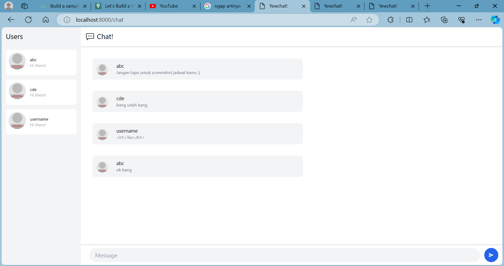
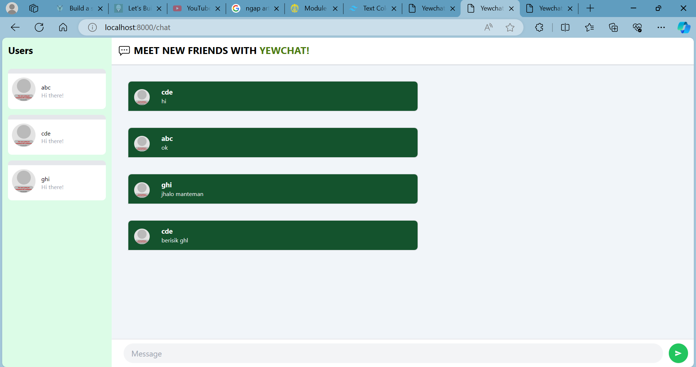

# advpro-tutorial10-yew

### 3.1. Original code
Setelah meng-clone kedua repository dari 
https://github.com/jtordgeman/YewChat/tree/websockets-part2
dan
https://github.com/jtordgeman/SimpleWebsocketServer
dapat dilakukan interaksi antar page yang telah memasukkan username ke dalam aplikasi. Hasilnya dapat dilihat seperti foto yang berada dibawah dimana ada tiga user yang saling bercakap-cakap bersama.

### 3.2. Be Creative
Untuk berkreasinya, saya melakukan perubahan terhadap warna pada aplikasi, dan tulisan users dibuat menjadi tebal. Selain itu, tulisan CHAT diubah menjadi "MEET NEW FRIENDS WITH YEEWCHAT" agar lebih menyenangkan keliatannya. YEEWCHAT juga diberi warna hijau agar sesuai dengan tema warna aplikasi.
Selain itu semua, diubah juga warna bubble chat menjadi hijau serta juga warna nama chatter menjadi putih agar lebih kontras.

